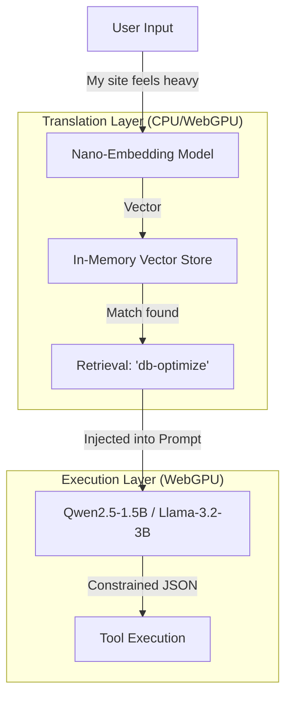

Here is a structured architectural decision record (ADR) formatted for your repository. This file explains the "Linguistic Translation" strategy to future contributors and solidifies the design choice.

You can save this as `docs/SLM-STRATEGY.md` or append it to `ARCHITECTURE.md`.

---

# SLM Strategy: The Semantic Translation Layer

> **Status Update (v0.2.0):** The upgrade to 7B models (Qwen2.5-7B, ~5GB VRAM) achieved **96% E2E accuracy** with 100% JSON reliability — without needing the semantic translation layer described below. Modern consumer hardware (16GB+ RAM with discrete/integrated GPU) runs 7B models comfortably via WebGPU. This strategy remains relevant as an optimization for **low-end hardware** where only 1.5B-3B models fit, but is no longer the primary approach.

## 1. The Challenge

Running Local AI in the browser imposes strict hardware constraints.

* **Constraint:** The average developer laptop (e.g., MacBook Air M1 8GB, standard Windows ultrabooks) cannot reliably run 7B+ parameter models alongside a browser and OS without crashing or severe throttling.
* **Target:** For low-end hardware, we must operate within the **1.5B – 3B** parameter range (approx. 1.2GB - 2.5GB VRAM). For standard hardware (16GB+ RAM), 7B models (~5GB VRAM) run well and achieve excellent accuracy without this layer.
* **The Problem:** Small Language Models (SLMs) are excellent at following syntax (e.g., "Output JSON") but struggle with **fuzzy intent mapping** (e.g., understanding that "The apple is rotten" means "Deactivate broken plugin").

## 2. The Solution: "Smart Routing, Dumb Worker"

Instead of relying on a single SLM to understand abstract metaphors and manage technical execution, we utilize a **Composite Architecture**.

We introduce a **Semantic Translation Layer** (The "Translator") that sits between the user and the SLM. This layer converts natural language intent into technical context *before* the SLM generates a response.

### Architecture Diagram



## 3. Technical Implementation

### Step 1: The "Translator" (Nano-Embeddings)

We use a tiny embedding model to map user intent to tool descriptions mathematically, rather than linguistically.

* **Model:** `Xenova/all-MiniLM-L6-v2` (via Transformers.js)
* **Size:** ~23MB (negligible memory footprint)
* **Function:** Converts text to vectors to find the highest cosine similarity between User Input and Registered Abilities.

**How it works:**

1. **Registration:** When an ability (e.g., `db-optimize`) is registered, we vectorize its description and keywords.
2. **Lookup:** User says "It's lagging." The embedding model matches this vector to `db-optimize` (Optimization) rather than `plugin-deactivate` (Repair).

### Step 2: Context Injection (The "Dictionary")

We do not ask the SLM to guess. We provide the answer from Step 1 as "context." This bridges the gap between the user's "5-year-old language" and the model's technical training.

**Prompt Construction:**

```text
SYSTEM: You are a WordPress SRE. Output strictly in JSON.

CONTEXT (Retrieved from Translation Layer):
The user's query is highly related to the tool: "db-optimize" (Database Optimization).

USER INPUT: "My site feels heavy."

TASK: Generate the JSON tool call to address this using the identified tool.

```

### Step 3: Grammar-Constrained Decoding

To ensure the 1.5B model never hallucinates invalid syntax, we use **Grammar Constraints** (JSON Schema enforcement) provided by the WebLLM engine.

* **Mechanism:** The inference engine forces the model's output tokens to conform to a specific BNF/JSON structure.
* **Benefit:** Even if the model is "confused" about the answer, it is mathematically impossible for it to output prose, markdown, or invalid JSON.

## 4. Hardware Impact Analysis

This composite approach respects our "Average Laptop" constraint while delivering "Server-Grade" intelligence.

| Component | Model | Size (VRAM/RAM) | Impact |
| --- | --- | --- | --- |
| **Translator** | `all-MiniLM-L6-v2` | **~23 MB** | Invisible. Runs instantly. |
| **Worker (SLM)** | `Qwen2.5-1.5B-Instruct` | **~1.2 GB** | Low. Leaves RAM for OS/Browser. |
| **Total Footprint** |  | **< 1.5 GB** | **✅ Safe for 8GB Laptops** |

## 5. Implementation Guide

### A. Registering Abilities with Semantic Tags

Plugins should provide clear synonyms to help the Translation Layer.

```php
register_agentic_ability( 'db-optimize', [
    'description' => 'Optimizes database tables to reduce size.',
    'semantic_tags' => ['slow', 'lag', 'heavy', 'cleanup', 'performance', 'speed up'],
    'callback'    => 'my_db_optimize_func'
]);

```

### B. The JS Matcher (Pseudo-code)

```javascript
import { pipeline } from '@xenova/transformers';

// 1. Load the tiny "Translator"
const extractor = await pipeline('feature-extraction', 'Xenova/all-MiniLM-L6-v2');

// 2. Vectorize User Input
const userVector = await extractor("The apple is rotten", { pooling: 'mean', normalize: true });

// 3. Find closest Ability (Dot Product)
const bestTool = findClosestVector(userVector, abilityVectors); 

// 4. Feed to SLM
const prompt = `
  User wants: "The apple is rotten". 
  This maps to technical task: ${bestTool.name}.
  Execute this tool.
`;

```

---

*Decision adopted on: [Date]*