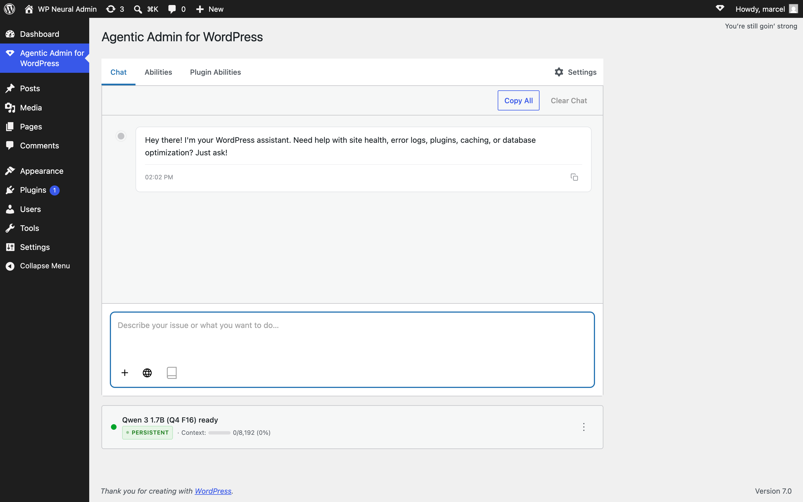
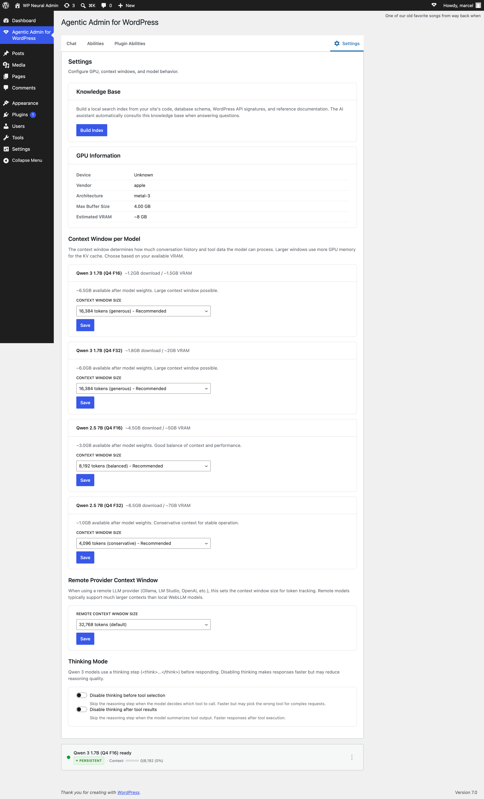
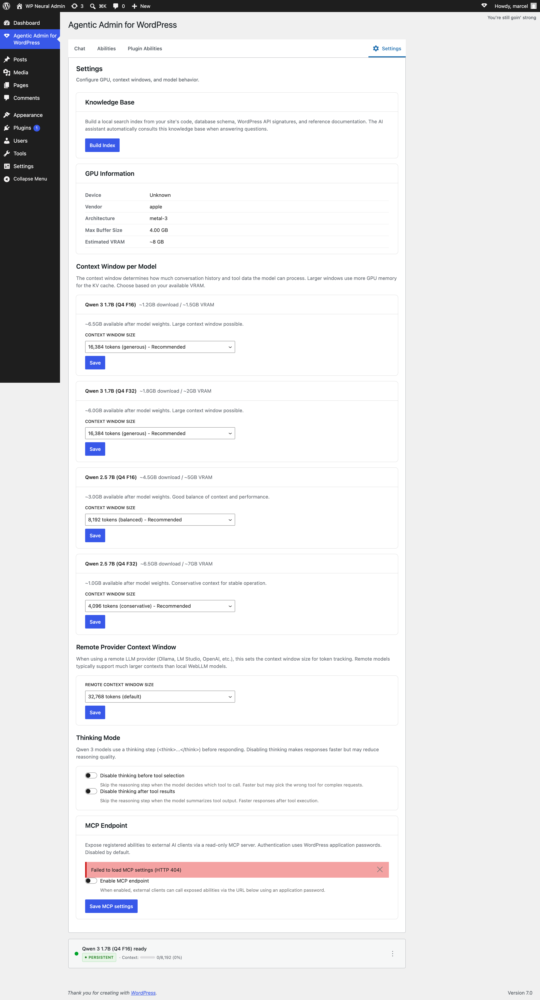
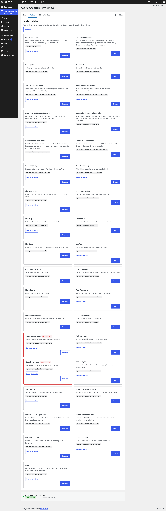
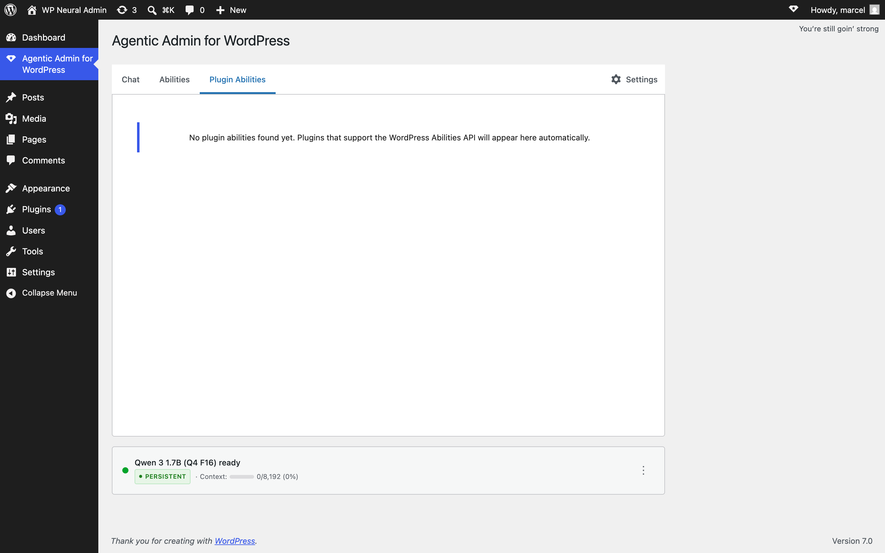
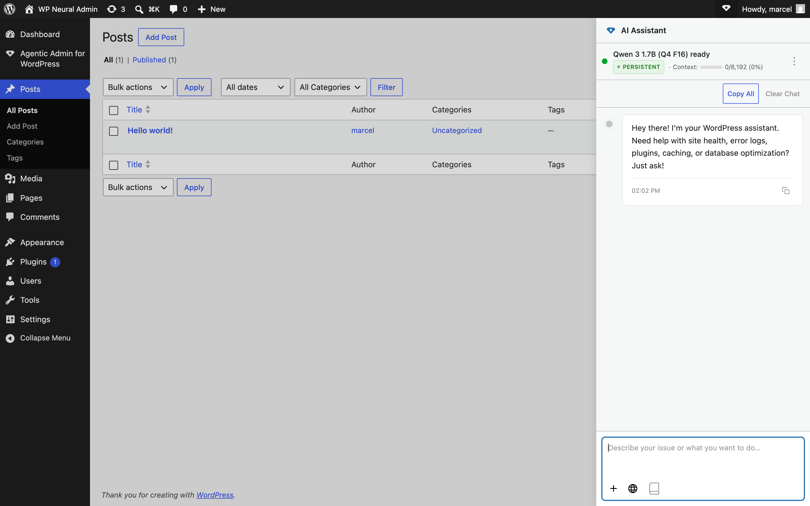

# UI Audit — WordPress 7.0

**Issue:** [#220 — Wider UI review to match WordPress 7.0 admin styling](https://github.com/pluginslab/wp-agentic-admin/issues/220)
**Target milestone:** v0.13 — WordPress.org Submission (with v0.14 spillover)
**Date:** 2026-05-23
**Plugin version at audit:** 0.12.0

## Framing — what this audit actually is

The issue describes "WordPress 7.0 just shipped and introduces refreshed admin UI styling." After diffing the shipped 7.0 files against 6.9.4 locally, **that framing is partially wrong**. The legacy admin shell (`wp-admin/css/common.css`, button classes, color tokens, card primitives) is visually unchanged in 7.0. Custom admin screens will not look "out of date" on 7.0 by default.

What *did* change and *does* affect this plugin:

1. **`@wordpress/components` jumped from 30.6.5 (in WP 6.9) to 32.2.0 (in WP 7.0)** with breaking default changes — most notably `__nextHasNoMarginBottom = true` on every form control. Stacked controls in our Settings tab will visually collapse.
2. **`@wordpress/admin-ui` removed from WP Core.** Still maintained in Gutenberg. We don't use it directly today, but anything that imports `@wordpress/admin-ui` from the core script handle will break.
3. **CSS class `.components-notice__action` removed** from the bundled stylesheet.
4. **Menu item height 40px → 32px** (denser dropdowns).
5. **`Button` font-weight changed to 499.**
6. **`DimensionControl` removed.**
7. **`Sandbox` default `allowSameOrigin` is now `false`.**

So the real audit goal is twofold:
- **(A) Functional safety:** survive the 30 → 32 component breaking changes before submission.
- **(B) Hygiene:** reduce hand-rolled UI in favor of `@wordpress/components`, and adopt WP design tokens (`var(--wp-admin-theme-color)` etc.) so user color schemes apply. This work isn't *forced* by WP 7.0 but it's the right time, and the issue body explicitly asks for it.

## Reference — WP 7.0 component & CSS changes that matter

Sources: `data/wp-includes/css/dist/components/style.css` vs `data/wp-includes.6.9.4.bak/...`; Gutenberg `wp/7.0` CHANGELOG (https://github.com/WordPress/gutenberg/blob/wp/7.0/packages/components/CHANGELOG.md).

### Breaking defaults — components likely already used in our codebase

| Component | Change | Where we use it |
|---|---|---|
| `BaseControl`, `TextControl`, `TextareaControl`, `SelectControl`, `CheckboxControl`, **`ToggleControl`**, `ToggleGroupControl`, `SearchControl`, `RangeControl`, `ComboboxControl`, `FormTokenField`, `TreeSelect`, `FocalPointPicker` | `__nextHasNoMarginBottom` defaults to **`true`** (32.0.0). Stacked controls no longer have ~24px bottom margin. | `PluginAbilitiesPanel.jsx` (ToggleControl). All other controls are hand-rolled today — but if we adopt them in fixes, this default applies. |
| `Button` | font-weight changed to `499` (30.7.0) | Used in `App.jsx`, `ChatContainer.jsx`. May render slightly lighter. |
| Menu/`DropdownMenu` items | Default item height 40px → 32px (32.0.0) | `ChatInput.jsx` (Dropdown), `MessageItem.jsx` ability list. |
| `Snackbar` | Default timeout shortened | `ChatContainer.jsx` |
| `Notice` | `.components-notice__action` CSS class removed; action button now supports `disabled` and may have both `url` and `onClick` | `App.jsx`, `WebGPUFallback.jsx`, `ChatContainer.jsx`. We don't currently target `.components-notice__action` in our SCSS — safe. |

### Removed / replaced

- **`@wordpress/admin-ui`** — bundled in 6.9, not in 7.0. We don't import this — safe.
- **`DimensionControl`** — removed (32.0.0). We don't use it — safe.

### New that we could adopt

- `Card` `size` prop now accepts an **object** for per-edge padding (30.8.0).
- `Notice` action button supports `disabled` + can combine `url` and `onClick` (good for the MCP card's "Copy endpoint URL" + "Open docs" pattern).
- `ConfirmDialog` has new `isBusy` prop (useful for tool execution confirmations).
- New CSS variable `--wp-components-color-gray-400`.

### Design tokens to adopt (independent of WP 7.0 — WordPress has shipped these for years)

Our `src/extensions/styles/main.scss` contains 62 literal `#2271b1`, 30 literal `#1d2327`, etc. — never `var(--wp-admin-theme-color)`. User color schemes (Modern, Light, Coffee, …) are not respected. WP exposes these on `:root` from `wp-admin/css/forms.css` (7.0) / `common.css` (6.9):

- `--wp-admin-theme-color` (default `#3858e9` in modern, `#2271b1` legacy)
- `--wp-admin-theme-color-darker-10`, `-darker-20`
- `--wp-admin-border-width-focus`

## Inventory — our UI surfaces

Fifteen React surfaces plus three SCSS stylesheets. **Most components already use `@wordpress/components` to a non-trivial degree.** The component-library adoption is in better shape than the issue body suggests.

| Surface | File | LOC | `@wordpress/components` used | Status |
|---|---|---|---|---|
| Main admin app shell | `src/extensions/App.jsx` | 295 | `Notice`, `Button` | OK |
| Chat sidebar mount (admin bar) | `src/extensions/admin-sidebar.js` + `styles/admin-sidebar.scss` (326 LOC) | 89 | — | DOM wiring, no React UI to migrate |
| Chat sidebar React shell | `src/extensions/components/AdminSidebar.jsx` | 214 | `Button` (after close-button PR) | OK after close-button PR |
| Chat conversation | `src/extensions/components/ChatContainer.jsx` | 993 | `Button`, `Modal`, `Notice`, `Snackbar` | partial; remaining custom areas are the conversation flow itself |
| Chat input bar | `src/extensions/components/ChatInput.jsx` | 368 | `Dropdown`, `Icon` | mostly custom (product-specific input design) |
| Individual message + tool-call card | `src/extensions/components/MessageItem.jsx` | 856 | (none) | **truly bespoke design language** — Perplexity-style chat bubbles. Intentional. |
| Model loader status | `src/extensions/components/ModelStatus.jsx` | 854 | `Button`, `DropdownMenu`, `MenuGroup`, `MenuItem`, `Spinner` (+ `@wordpress/icons`) | already migrated to component primitives; remaining custom is product-specific progress UI |
| Settings tab | `src/extensions/components/SettingsTab.jsx` | 591 | `Button`, `Card`, `CardHeader`, `CardBody`, `SelectControl`, `Notice`, `ToggleControl` | **already heavily migrated**. Minor nits in §2 below. |
| Abilities catalog | `src/extensions/components/AbilityBrowser.jsx` | 385 | `Spinner` | could adopt `Card` for the per-ability tiles |
| Plugin abilities panel | `src/extensions/components/PluginAbilitiesPanel.jsx` | 389 | `Spinner`, `ToggleControl` | OK |
| Ability picker (in chat input) | `src/extensions/components/AbilityPicker.jsx` | 131 | — | custom dropdown |
| File view (tool result) | `src/extensions/components/FileView.jsx` | 80 | — | custom |
| WebGPU fallback | `src/extensions/components/WebGPUFallback.jsx` | 161 | `Notice`, `ExternalLink` | OK |
| Editor sidebar (Gutenberg plugin) | `src/extensions/components/EditorSidebar.jsx` + `styles/editor-sidebar.scss` (246 LOC) | 137 | — | out of scope for this audit (separate surface) |
| Parked | `src/extensions/components/VoiceButton.jsx` | 400 | — | parked per roadmap |

**Correction note:** an earlier draft of this audit claimed `SettingsTab.jsx` and `ModelStatus.jsx` had zero `@wordpress/components` usage. That was wrong — the inventory script missed multi-line imports (`import {\n` with the brace on its own line). Both files are migrated to a reasonable degree. The v0.13 fix list below was tightened accordingly.

**SCSS:**
- `src/extensions/styles/main.scss` — **3,599 LOC**, 62× literal `#2271b1`, zero `var(--wp-*)` token usage
- `src/extensions/styles/admin-sidebar.scss` — 326 LOC
- `src/extensions/styles/editor-sidebar.scss` — 246 LOC

## Per-surface findings

Screenshots in `docs/audit-assets/wp-7.0-before/`.

### 1. Main admin page (`agentic-admin`)

| # | Finding | Priority | Recommended fix |
|---|---|---|---|
| 1.1 | Hand-rolled tab strip ("Chat / Abilities / Plugin Abilities" + "Settings" gear button) using `wp-agentic-admin-tab` class | P1 | Use `@wordpress/components` `TabPanel` or `Tabs` (32.0.0). Keeps keyboard nav + a11y for free. |
| 1.2 | "Copy All" + "Clear Chat" buttons at top of chat panel are hand-rolled | P2 | Use `Button` `variant="tertiary"` for "Copy All", `variant="secondary"` for "Clear Chat" (`isDestructive` if confirming). |
| 1.3 | Greeting bubble has an inline timestamp + copy button — custom card | P2 | Acceptable as a custom chat-bubble design (this is the product's identity). No fix. |

### 2. Settings tab

**Current state on `dev` (no MCP yet):**

**Future state after PR #216 merges (includes MCP Endpoint card):**

The "HTTP 404" visible in the second screenshot is **not a bug** — it was a stale build artifact: a JS bundle built on the `feat/001-mcp-server-endpoint` branch was still on disk when viewing the dev branch (which doesn't have the PHP routes yet). After rebuilding on dev, the MCP card disappears as expected. PR #216 ships both halves together.

| # | Finding | Priority | Recommended fix |
|---|---|---|---|
| 2.1 | KB progress bar uses hand-rolled `
` with hardcoded `#007cba` | P2 | Replace with `ProgressBar` (stabilised in @wordpress/components 32.0.0) or tokenise the literal. |
| 2.2 | KB status display is a hand-rolled `<table>` with custom class | P2 | Definition-list pattern is fine, or migrate to `__experimentalGrid`. Low priority. |
| 2.3 | "Context Window per Model" + "Remote Provider Context Window" h3 headings sit OUTSIDE any `Card` (KB / GPU Info / Thinking Mode each have a `CardHeader`). Inconsistent grouping. | P2 | Wrap each section's heading in `CardHeader` for consistency, OR pull all section headings out of cards. Cosmetic. |
| 2.4 | "Disable thinking before tool selection" + "Disable thinking after tool results" rendered as two stacked `ToggleControl`s | P2 | These are independent toggles, so `ToggleControl` is correct. Worth verifying spacing in WP 7.0 since `__nextHasNoMarginBottom` defaults to `true` — controls may visually collapse. |
| 2.5 | Inline `style={{...}}` calls scattered across the file | P3 | Move to SCSS. Pure hygiene. |
| 2.6 | MCP Endpoint card (post-#216) has its own custom toggle and "Save MCP settings" button | P1 (post-#216) | Replace custom toggle with `ToggleControl`. Replace Save button with `Button variant="primary"`. Migrate when #216 lands. |

### 3. Abilities tab

| # | Finding | Priority | Recommended fix |
|---|---|---|---|
| 3.1 | Two-column card grid is clean and consistent; layout is fine | — | Keep. |
| 3.2 | Each ability card is hand-rolled with title + description + monospace ID + Execute button | P2 | Migrate the card shell to `Card`/`CardHeader`/`CardBody`/`CardFooter`. Keep the monospace ID block as-is (custom). |
| 3.3 | Highlighted (red border) ability cards (e.g. "Clear Log Records", "Deactivate Plugin") | P2 | If marking destructive abilities, set `isDestructive` on the Execute `Button` instead of the card border, or use a `Notice` `status="warning"` inside the card. |
| 3.4 | "Execute" button on every card | P2 | `Button variant="primary"` or `variant="secondary"` consistent with severity. |

### 4. Plugin Abilities tab (empty state)

| # | Finding | Priority | Recommended fix |
|---|---|---|---|
| 4.1 | Empty state uses a `Notice` (blue left border) inside a card | — | Looks correct. Keep. |
| 4.2 | Did not capture a populated state (would need a third-party plugin exposing Abilities API) | — | Capture after fixes land, or add a fixture plugin to e2e screenshots. |

### 5. Admin-bar chat sidebar

| # | Finding | Priority | Recommended fix |
|---|---|---|---|
| 5.1 | Right-rail sidebar (~400px) opens cleanly on any wp-admin page | — | Pattern works. Keep. |
| 5.2 | Header ("AI Assistant" + status pill + 3-dot menu) hand-rolled | P2 | `Card` + `__experimentalHStack` for header layout; menu via `DropdownMenu` (note: 32px item height in 7.0). |
| 5.3 | Bottom input area duplicated from main view | P2 | Already shared as `ChatInput.jsx`. Confirm no divergent styling. |
| 5.4 | No close (×) button visible in header — relies on overlay click or Escape | P1 | Add explicit close `Button icon={close}` for discoverability. |

### 6. Model status / loader (`ModelStatus.jsx`)

Not captured in isolation (would need to trigger model load from cold). 854 LOC, zero `@wordpress/components`.

| # | Finding | Priority | Recommended fix |
|---|---|---|---|
| 6.1 | Fully hand-rolled progress UI + model picker + GPU detection display | P1 | This is the largest single hand-rolled surface. Out of scope to rewrite for v0.13 — keep on v0.14 list. |
| 6.2 | Status pill at bottom of every view ("Qwen 3 1.7B (Q4 F16) ready" + PERSISTENT + Context meter) | P2 | The pill itself is fine. Context meter (the inline progress bar) could become `ProgressBar` (32.0.0 stabilised). |

### 7. SCSS — design tokens

| # | Finding | Priority | Recommended fix |
|---|---|---|---|
| 7.1 | 62× literal `#2271b1` — accent color hardcoded; user color schemes ignored | P1 | Replace with `var(--wp-admin-theme-color)`. Fall back via `@supports` or just commit; WP has shipped this token since 5.7. |
| 7.2 | Other literal tokenisable colors (`#1d2327` text, `#646970` muted, `#c3c4c7` border, `#f6f7f7` surface) | P2 | These are stable across WP themes and aren't tokenised in core. Acceptable as literals, but move to one `$variables` SCSS partial so they're swappable. |
| 7.3 | No tests for color-scheme override | P2 | Add an e2e check that activates a non-default color scheme (e.g. "Modern") and screenshots the plugin's primary accent. |

## Prioritized fix list — release split

### v0.13 (submission gate) — must-do

These are functional safety items that block a confident WP 7.0 submission. The list narrowed from the initial draft after (a) discovering the "MCP 404" was a stale-build artifact, not a bug, and (b) re-inventorying showed `SettingsTab.jsx` and `ModelStatus.jsx` were already migrated to `@wordpress/components`.

1. **[P1] Replace 62× `#2271b1` literal with `var(--wp-admin-theme-color)`** in `main.scss` + `admin-sidebar.scss` — done in `feat/220-wp-admin-theme-token`
2. **[P1] Add explicit close button to admin-bar sidebar header** — done in `feat/220-admin-sidebar-close-button`

Both PRs include before/after screenshots in this audit's `audit-assets/wp-7.0-before/`.

### v0.14 (post-submission polish)

3. **[P2] SettingsTab nits**: KB progress bar `
` → `ProgressBar` (or token), wrap Context-Window section heading in `CardHeader` for consistency, move inline styles to SCSS.
4. **[P2] Verify `__nextHasNoMarginBottom = true` default doesn't visually collapse stacked `ToggleControl`s in Thinking Mode** on WP 7.0.
5. **[P2] Migrate MCP Endpoint card to `ToggleControl` + `Button variant="primary"`** — depends on #216 landing first.
6. **[P2] Abilities tab → `Card` primitives** for per-ability tiles.
7. **[P2] Tabs → `TabPanel`/`Tabs`** (keyboard nav + a11y for free).
8. **[P2] Move SCSS literal colors to a `$tokens.scss` partial.**
9. **[P2] Capture populated Plugin Abilities tab state** (add a fixture plugin to e2e).
10. **[P2] ModelStatus.jsx review** — already uses `Button`/`DropdownMenu`/`Spinner`. Remaining custom is the progress UI; treat as its own PR if/when needed.

## Out of scope

- **EditorSidebar.jsx** — Gutenberg block-editor side panel. Separate audit when we revisit the editor flow.
- **VoiceButton.jsx** — parked per [v1 roadmap](.claude/plans/...).
- Information architecture changes to the Settings tab (sections, ordering). Issue body explicitly says "Restructuring the Settings IA is a separate issue if needed."

## Verification done during audit

- Local docker stack upgraded from WP 6.9.4 → 7.0 (manual core swap, `data/wp-admin.6.9.4.bak/` + `data/wp-includes.6.9.4.bak/` retained for diff)
- WP 7.0 dashboard rendered (`docs/audit-assets/wp-7.0-before/00-wp-dashboard.png`)
- All 4 plugin tabs + admin-bar sidebar captured
- CSS diff: `wp-admin/css/common.css` 6.9.4 → 7.0 — no removed/renamed admin classes
- Component CSS diff: only `.components-notice__action` removed from the bundled stylesheet — we do not target it

## Screenshot index

- `00-wp-dashboard.png` — WP 7.0 baseline (no plugin)
- `01-plugin-main-initial.png` — plugin main page, Chat tab
- `02-settings-tab-full.png` — Settings tab as it appears with stale MCP build (post-#216 preview)
- `02b-settings-tab-on-dev.png` — Settings tab as it actually exists on `dev` today
- `03-abilities-tab.png` — Abilities catalog (full page)
- `04-plugin-abilities-tab.png` — Plugin Abilities tab, empty state
- `05-admin-sidebar-on-posts.png` — admin-bar chat sidebar overlaid on Posts list
- `06-after-token-migration.png` — plugin main after `var(--wp-admin-theme-color)` migration, default Fresh scheme (visually identical to baseline)
- `07-token-with-modern-scheme.png` — token migration with Modern color scheme active
- `08-token-with-sunrise-scheme.png` — token migration with Sunrise scheme: orange accents now flow into plugin UI
- `09-admin-sidebar-with-close.png` — admin-bar sidebar after close-button PR (× icon top-right)
